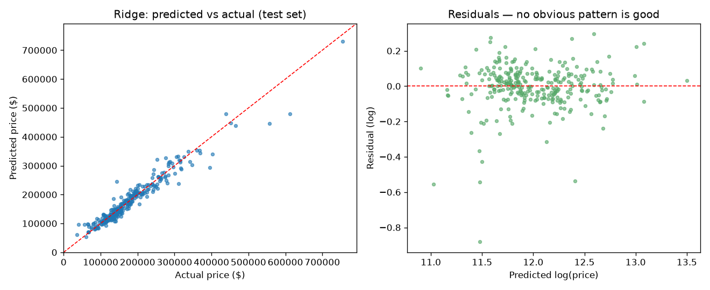
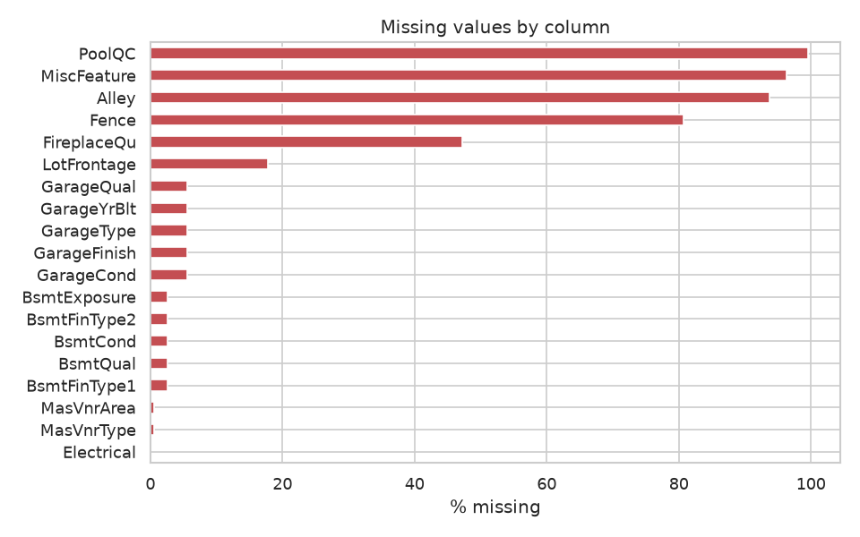
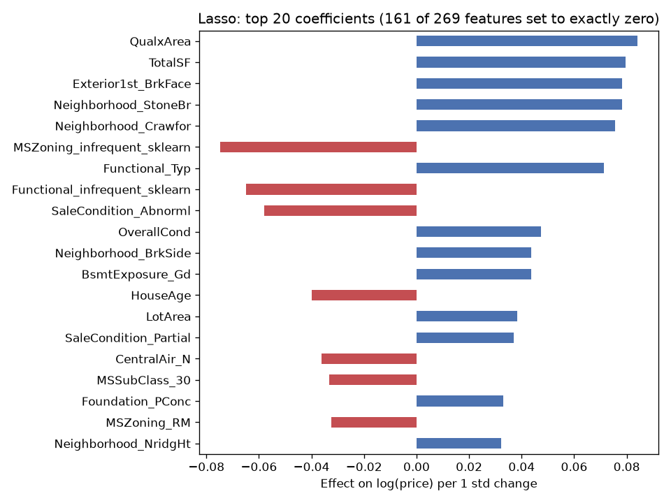

# 🏠 House Price Prediction (Ames, Iowa)

Predicting what a house sells for, using the **Ames Housing** dataset: 1,460 homes sold between 2006 and 2010, each described by 79 features (everything from lot size to the quality of the kitchen to how many fireplaces it has).

It's a much messier dataset than Iris, and most of the work went into cleaning and feature engineering, not into the model.

## Results (held-out test set, 292 houses)

| Model | CV RMSE (log) | Test RMSE (log) | Test MAE | Test R² |
|---|---|---|---|---|
| Baseline: always guess the median | 0.391 | 0.432 | $59,568 | 0.00 |
| Linear Regression | 0.123 ± 0.008 | 0.119 | $14,047 | 0.924 |
| **Ridge** (α ≈ 29) | **0.109 ± 0.006** | 0.126 | $14,067 | 0.915 |
| Lasso (α ≈ 0.0006) | 0.109 ± 0.005 | 0.123 | $13,832 | 0.918 |

**In plain English:** a typical prediction is off by about **$14k**, on houses that average about $180k. A log-RMSE of ~0.12 means errors of roughly ±12%.

Ridge was selected because it had the best cross-validation score. Plain Linear Regression happened to do slightly better on this particular test split, but its CV scores were worse *and* more variable from fold to fold. Regularisation buys you stability, which you can't see from a single test number.



## What actually made a difference

1. **Predicting log(price) instead of price.** Prices are right-skewed (skew 1.9 → 0.1 after the log). It also means the model cares about *percentage* errors, which is what you want: being $20k off on a $100k house is much worse than on a $500k house.
2. **Realising most "missing" values aren't missing.** `PoolQC` is blank for 99.5% of houses... because they don't have a pool. Same for alleys, fences, garages and basements. Filling these with `"None"` (or 0 for areas) instead of the mean was the single biggest cleanup.
3. **Turning quality ratings into numbers.** Columns like `KitchenQual` use Ex / Gd / TA / Fa / Po. Mapping these to 5…1 tells the model that "Excellent > Good", which one-hot encoding throws away.
4. **A few engineered features:** total square footage (basement + floors), total bathrooms, house age at sale, years since remodel, porch area, `OverallQual × GrLivArea`, and a few has-garage / has-basement flags.
5. **Removing two outliers**, but only from training data. Two enormous houses (>4,000 sq ft) sold for suspiciously little. The person who compiled the dataset recommends dropping them because they were partial sales.
6. **Imputing `LotFrontage` by neighbourhood median.** Houses on the same street have similar frontage. I wrote a tiny sklearn transformer for this so it's learned only from the training fold.



## What the model learned

Lasso set **161 of the 269 encoded features to exactly zero**, which is a nice automatic feature selection. The biggest remaining drivers are the quality × living-area interaction I engineered, total square footage, and location (StoneBrook and Crawford push prices up). On the negative side are rare zoning classes (mostly commercial) and "abnormal" sales such as foreclosures, which pull prices down.



## Project structure

```
02-house-price-prediction/
├── src/
│   ├── data.py       # downloads Ames from OpenML (cached in data/), outlier rule
│   ├── features.py   # cleaning, ordinal mapping, engineered features, LotFrontage imputer
│   ├── eda.py        # distribution, missing values, correlations, neighbourhood plots
│   ├── train.py      # baseline / Linear / Ridge / Lasso, CV + test evaluation, plots
│   └── predict.py    # predict prices for a CSV of houses
├── samples/example_houses.csv   # 5 raw test-set houses to try predict.py on
├── tests/
├── outputs/          # metrics.json + figures/
└── models/
```

## Run it

The dataset downloads automatically the first time you run anything (it's small), and the trained model is already included, so `predict` works straight away.

```bash
git clone https://github.com/Shreyabhawsar/house-price-prediction.git
cd house-price-prediction
python -m venv .venv && source .venv/bin/activate   # Windows: .venv\Scripts\activate
pip install -r requirements.txt

python -m src.eda
python -m src.train
python -m src.predict samples/example_houses.csv
# House 1: Sawyer    1068 sq ft, built 1963  ->  $149,599
# House 2: NoRidge   2622 sq ft, built 1994  ->  $330,690
# ...
pytest -q
```

## If I took this further

- Gradient boosting (XGBoost / LightGBM) would likely get the log-RMSE under 0.11, and averaging it with Ridge usually helps even more.
- Check residuals by neighbourhood. I suspect the model is systematically off in a couple of them.
- Prices here are 2006–2010, right through the housing crash. A model meant for real use would need to account for time.

---

## Part of a series

This is one of five ML projects I built while learning machine learning, each in its own repo:

- [🌸 Iris Flower Classification](https://github.com/Shreyabhawsar/iris-flower-classification)
- [🏠 House Price Prediction](https://github.com/Shreyabhawsar/house-price-prediction) ← you are here
- [📉 Customer Churn Prediction](https://github.com/Shreyabhawsar/customer-churn-prediction)
- [📩 Spam Classifier](https://github.com/Shreyabhawsar/spam-email-classifier)
- [✍️ Handwritten Digit Recognition (MNIST)](https://github.com/Shreyabhawsar/mnist-digit-recognition)

MIT licensed. See [LICENSE](LICENSE).
